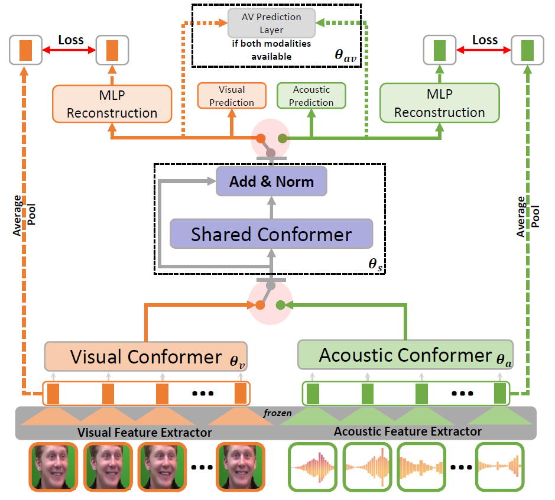

# VAVL
Versatile Audio-Visual Learning for Handling Single and Multi Modalities in Emotion Regression and Classification Tasks. Learn 

[](https://paperswithcode.com/sota/arousal-estimation-on-msp-improv?p=versatile-audio-visual-learning-for-handling)
	
[](https://paperswithcode.com/sota/video-emotion-recognition-on-crema-d?p=versatile-audio-visual-learning-for-handling)
	
## Abstract
A challenging task in audiovisual emotion recognition is to implement neural network architectures that can leverage and fuse multimodal information while temporally aligning modalities, handling missing modalities, and capturing information from all modalities without losing information during training. These requirements are important to achieve model robustness and to increase accuracy on the emotion recognition task. A recent approach to perform multimodal fusion is to use the transformer architecture to properly fuse and align the modalities. This study proposes the AuxFormer framework, which addresses in a principled way the aforementioned challenges. AuxFormer combines the transformer framework with auxiliary networks. It uses shared losses to infuse information from single-modality networks that are separately embedded. The extra layer of audiovisual information added to our main network retains information that would otherwise be lost during training.

### Paper
[Access to the paper](https://arxiv.org/pdf/2305.07216.pdf)

Lucas Goncalves, Seong-Gyun Leem, Wei-Cheng Lin, Berrak Sisman, and Carlos Busso "Versatile audiovisual learning for handling single and multi modalities in emotion regression and classification tasks," ArXiv e-prints (arXiv:2305.07216), pp. 1-14, May 2023.

#### Please cite our paper if you find our work useful for your research:

```tex
@article{Goncalves_2023_2,
	author = {L. Goncalves and S.-G. Leem and W.-C. Lin and B. Sisman and C. Busso},
	title = {Versatile Audiovisual Learning for Handling Single and Multi Modalities in Emotion Regression and Classification Tasks},
	journal = {ArXiv e-prints (arXiv:2305.07216 )},
	archivePrefix = {arXiv},
	eprint = {2305.07216 },
	primaryClass = {cs.LG},
	volume = {},
	number = {},
	year = {2023},
	pages = {1-14},
	month = {May},
	doi={10.48550/arXiv.2305.07216},
}
```

## Using model

### Dependencies
* Python 3.9.7
* Pytorch 1.12.1
* To create conda environment based on requirements use: `conda env create -f VAVL.yml`
* Activate environment with: `conda activate VAVL`

### Datasets Used
1. [CREMA-D](https://www.ncbi.nlm.nih.gov/pmc/articles/PMC4313618/) 
2. [MSP-IMPROV](https://ecs.utdallas.edu/research/researchlabs/msp-lab/MSP-Improv.html)

### Features
* Download pre-trained EfficientNet B2 (enet_b2_8_best.pt) model from [here](https://drive.google.com/file/d/1MVaJ9llhUckZlbRGGD7plw6GBZqrqFPQ/view?usp=sharing). After downloading save model under `/facial_features/model/enet_b2_8_best.pt`
* Download pre-trained wav2vec model from [here](https://drive.google.com/file/d/1xzxFcXuj8-xMWN9yE-4jgIeFoSdMvO5S/view?usp=sharing). After downloading save model under `VAVL/wav2vec/final_wav2vec.pt`
* Update your data paths in `audio_extraction/audio_extractor.py` and in `facial_features/face_extractor.py`
* Run the script `bash audio_and_visual_prep.sh` 
* This script extracts audios from videos and convert audios to 16Hz and mono-channel using code in ``audio_extraction``
* This script also extract faces from videos, align the faces, and extract features to be used for training/inference. It uses code in ``facial_features``


## Running the model
* All model files are located in `VAVL`
* Enter the correct path to the downloaded pre-trained wav2vec model in [line 114 of train.py](https://github.com/ilucasgoncalves/VAVL/blob/main/VAVL/train.py#L114)
* Update your data and feature paths in `VAVL/utils/etc.py` [here](https://github.com/ilucasgoncalves/VAVL/blob/main/VAVL/utils/etc.py)
* Model can be run using sample run files `run_cremad.sh` for CREMA-D or `run_mspimprov.sh` for MSP-IMPROV.

<p align="center">
  
</p>
